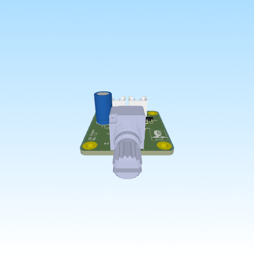

# LED Dimmer

**Rev:** 1.1

A compact analog LED dimmer PCB using a 555 timer to generate an adjustable PWM signal that drives a logic-level MOSFET for smooth LED brightness control.

## Features

- **Single-Channel PWM Control:** Adjustable LED brightness
- **PWM Generator:** NE555 timer based oscillator
- **Adjustable Brightness:** 50kΩ potentiometer
- **MOSFET Output Stage:** Logic-level N-channel MOSFET switching
- **Supply Voltage:** 12V DC input
- **LED Compatibility:** Suitable for LEDs and LED strips with appropriate current limiting
- **PCB:** Compact 2-layer layout with ground plane
- **JST XH Connectors:** 2-pin JST B2B-XH-A connectors for power input and LED output
- **Bulk Capacitance:** 470µF input capacitor for supply stabilization

## Design Overview

### PWM Generation

The circuit uses an **NE555 timer configured as an adjustable PWM oscillator**. The duty cycle is controlled using a **50kΩ potentiometer** with two steering diodes that provide separate charge and discharge paths for the timing capacitor.

This configuration provides:

- Smooth brightness adjustment
- Wide PWM duty cycle range
- Consistent LED brightness control without varying the LED supply voltage
- Simple analog control without requiring a microcontroller

### Output Stage

The PWM signal from the NE555 drives the gate of an **IRLML6344 logic-level N-channel MOSFET** through a gate resistor.

 The MOSFET operates as a **low-side switch**, connecting and disconnecting the LED load from ground according to the PWM duty cycle.

A gate pull-down resistor ensures that the MOSFET remains off when the PWM signal is not actively driving the gate.

Key characteristics:

- Low gate drive requirements
- Efficient PWM switching
- Minimal heat generation at typical LED currents
- Suitable for individual LEDs, LED strings, and low-power LED strips

### Power Input

The board operates from a **12V DC supply** connected through a **2-pin JST B2B-XH-A connector**.

A **470µF bulk capacitor** is placed across the input supply to stabilize the 12V rail and help reduce voltage transients and switching noise generated by the PWM circuit.

Additional local decoupling capacitors are used around the NE555 to improve supply stability.

Typical 12V supply sources include:

- External regulated 12V power supplies
- USB-C PD trigger modules
- DC bench supplies

### LED Output

The LED output is provided through a second **2-pin JST B2B-XH-A connector**.

The connector provides:

- **+12V supply**
- **PWM-switched low-side output**

The connected LED load is supplied directly from the 12V rail, while the MOSFET switches the return path to ground.

LEDs must include appropriate **current limiting resistors** unless the connected LED module or LED strip already incorporates its own current limiting.

## Electrical Specifications

- **Input Voltage:** 12V DC
- **PWM Channels:** 1
- **Control Method:** Analog PWM dimming
- **PWM Generator:** NE555 timer
- **Brightness Control:** 50kΩ potentiometer
- **Switching Device:** IRLML6344 logic-level N-channel MOSFET
- **Bulk Supply Capacitor:** 470µF

## Key Components

- **U1:** NE555 Timer IC (PWM generator)
- **Q1:** IRLML6344 N-channel MOSFET (LED switching)
- **R3:** 50kΩ potentiometer (PWM duty-cycle / brightness control)
- **D1–D2:** Signal diodes (PWM steering network)
- **C1:** 0.1µF timing capacitor
- **C2:** 10nF 555 control-voltage bypass capacitor
- **C3:** 470µF bulk supply capacitor
- **C4:** 0.1µF supply decoupling capacitor
- **J1:** 2-pin JST B2B-XH-A power input connector
- **J2:** 2-pin JST B2B-XH-A LED output connector

## Use Cases

- LED brightness control
- LED strip dimming
- DIY lighting projects
- Electronics learning projects involving PWM
- Integration with USB-C PD power modules
- Custom lighting for enclosures and displays
- Bench-top experimentation with analog PWM control
