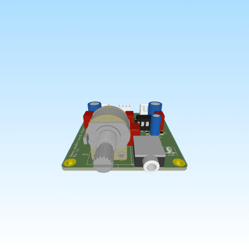

# Stereo Amplifier Dual BTL TDA2822

**Rev:** 1.0

This project is a compact, high-output stereo amplifier PCB based on two TDA2822 audio power amplifier ICs. Each IC is configured in bridged-tied-load (BTL) mode to drive a single speaker, providing higher output power than the standard stereo configuration. The design includes onboard analog volume control, a standard 3.5 mm auxiliary input, and differential speaker outputs.

## Features

- **Amplifier ICs:** Dual TDA2822 / TDA2822M audio power amplifiers
- **Configuration:** Stereo (BTL mode, one IC per channel)
- **Volume Control:** 50kΩ dual-gang potentiometer
- **Input:** 3.5 mm TRS auxiliary (line-level)
- **Output:** Differential BTL speaker outputs
- **Rated Output Power:** Higher output than standard single-ended TDA2822 configuration
- **Power Supply:** 6–15V DC (single supply)
- **PCB:** 2-layer layout with solid ground plane
- **Stability Features:**
  - Output Zobel networks
  - Input bias network
  - Local supply decoupling
- **Mounting:** Integrated mounting holes for enclosure installation

## Design Overview

### Power Input

- Single-supply operation (6–15V DC recommended)
- 220µF bulk reservoir capacitors for each amplifier
- 0.1µF ceramic decoupling capacitors placed near each IC VCC pin
- Solid ground plane for low impedance return paths

### Input Stage

- 3.5 mm auxiliary input (line-level)
- 2.2µF AC coupling capacitors
- 50kΩ dual-gang potentiometer for volume control
- Input bias resistors to ground

### Amplifier Stage

- Two TDA2822 ICs configured in bridged-tied-load (BTL) mode
- One IC dedicated to the left channel and one to the right
- Local feedback and compensation components for stable operation

### Output Stage

- Differential (bridge) speaker outputs
- Zobel network (4.7Ω + 0.1µF) on each amplifier output for stability
- Designed for 8Ω speaker loads

> **Note:** Since this is a BTL amplifier, neither speaker terminal should be connected to ground.

## Layout Notes

- High-frequency decoupling capacitors placed directly near each IC VCC pin.
- Symmetrical left/right channel layout for consistent performance.
- Ground plane used for low impedance return paths.
- Short, direct routing of input, feedback, and speaker output traces.
- Ground stitching vias used to reinforce return paths.

## Use Cases

- Desktop speaker systems
- DIY Bluetooth speaker builds (with external Bluetooth module)
- Portable speaker projects
- Educational analog electronics projects
- General-purpose audio amplification
