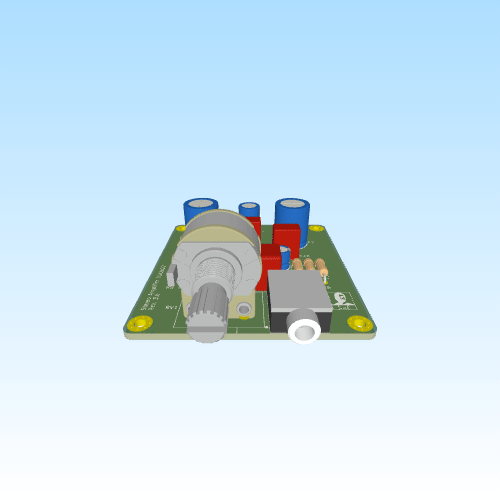

# Stereo Amplifier TDA2822

**Rev:** 3.0

This project is a compact stereo audio amplifier PCB based on the TDA2822 audio power amplifier IC. The amplifier is configured in the standard stereo (single-ended) configuration, providing clean, low-noise audio for small speakers. The design includes an onboard analog volume control, a standard 3.5 mm auxiliary input, and AC-coupled speaker outputs suitable for general-purpose audio applications.

## Features

- **Amplifier IC:** Single TDA2822 dual-channel audio power amplifier
- **Configuration:** Stereo (single-ended mode)
- **Volume Control:** 50 kΩ dual-gang potentiometer
- **Input:** 3.5 mm TRS auxiliary (line-level)
- **Output:** AC-coupled stereo speaker outputs
- **Power Supply:** 6–15 V DC (single supply)
- **PCB:** Compact 2-layer PCB with solid ground plane
- **Mixed Technology Design:**
  - SMD resistors and ceramic capacitors
  - Through-hole electrolytic capacitors
- **Power Filtering:**
  - 470 µF bulk supply capacitor
  - Local 0.1 µF ceramic decoupling
- **Stability Features:**
  - Output Zobel networks
  - Input bias network
  - Local supply decoupling
- **Mounting:** Four integrated mounting holes

## Design Overview

### Power Input

- Single-supply operation (6–15 V DC recommended)
- 470 µF bulk reservoir capacitor for supply filtering
- 0.1 µF ceramic decoupling capacitor located directly adjacent to the TDA2822 VCC pin
- Wide power routing with a continuous ground plane for low-impedance current return

### Input Stage

- Standard 3.5 mm stereo auxiliary input
- 2.2 µF AC coupling capacitors on both channels
- 50 kΩ dual-gang potentiometer providing analog volume adjustment
- 47 kΩ input pulldown resistors to establish a stable input reference
- 18 kΩ input bias resistors at the amplifier inputs

### Amplifier Stage

- Single TDA2822 configured in standard stereo (single-ended) mode
- Independent left and right amplifier channels
- 100 µF feedback capacitors providing AC gain stabilization and improved low-frequency response
- Local supply decoupling positioned adjacent to the IC to reduce supply noise

### Output Stage

- 2200 µF output coupling capacitors for DC isolation
- Individual Zobel network (4.7 Ω resistor + 0.1 µF capacitor) on each output for amplifier stability
- Designed for 8 Ω speaker loads

## PCB Layout

The PCB has been arranged to minimize noise while maintaining a compact footprint:

- Symmetrical left/right channel layout
- Short routing between the amplifier outputs and output capacitors
- Local decoupling positioned immediately beside the amplifier supply pin
- Continuous ground plane for low-impedance return paths
- Ground stitching vias throughout the power section
- Separation of input and output routing to reduce unwanted coupling
- Wide power traces for improved current handling

## Use Cases

- Desktop stereo speakers
- DIY Bluetooth speaker projects (with an external Bluetooth receiver)
- Educational analog electronics projects
- Portable audio projects
- Small multimedia speaker systems
- General-purpose stereo audio amplification
