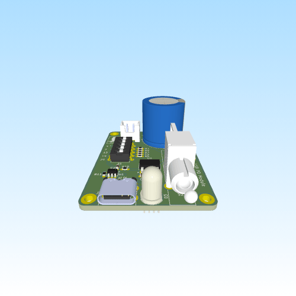

# USB PD Module

**Rev:** 4.5

A compact, configurable USB-C Power Delivery trigger module based on the CH221K, designed for safe and reliable voltage PD negotiation with a simple and robust power output.

## Features
- USB-C Power Delivery trigger based on CH221K
- Negotiates fixed PD voltages: 5V / 9V / 12V / 15V / 20V
- 5-position DIP switch voltage selection
- Direct output (no MOSFET gating for improved reliability)
- RGB LED status indicator:
  - **Red:** Standard 5V (no PD negotiation)
  - **Purple:** PD negotiated voltage active
- Large bulk output capacitor (4700 µF)
- Output bleed resistor for faster discharge
- Compact 2-layer PCB
- Mounting holes for enclosure integration

## Design Overview

### Simplified Power Path

The output is directly driven by the negotiated voltage from the CH221K, ensuring consistent and reliable operation across all supported voltage levels.

### Status Indication

An RGB LED is used to indicate power state:

- **Red:** Default USB 5V (no PD contract established)  
- **Purple:** Successful PD negotiation (selected voltage active)

This provides immediate visual feedback without affecting the power path.

### PD Configuration

Voltage selection is handled via a resistor ladder and DIP switch connected to the CH221K configuration input.

### Signal Integrity

- Short, symmetric CC1/CC2 routing  
- ESD protection on CC lines  
- Local decoupling at the PD controller  
- Solid ground plane with stitched returns  

## Electrical Specifications

- **Input:** USB-C PD source  
- **Negotiated Output Voltages:** 5V, 9V, 12V, 15V, 20V  
- **Max Output Current:** Limited by USB-C source  
- **Output Capacitance:** 4700 µF bulk  

## Key Components

- **U1:** CH221K USB-C PD controller  
- **C1:** 4700 µF bulk output capacitor  
- **USB-C Connector:** 6-pin USB-C receptacle  
- **U2:** SPX1117M3 LDO regulator  
- **LED:** RGB LED for status indication  
